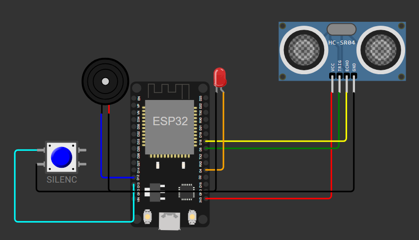
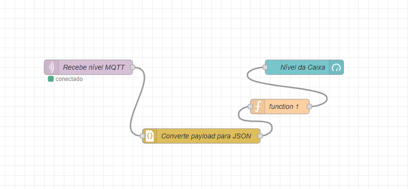

# AquaSOS – IoT para Monitoramento de Estoque de Água

## 📄 Autores
* **Gustavo Lopes Santos da Silva** - RM: 556859
* **Renato de Freitas David Campiteli** - RM: 555627
* **Gabriel Santos Jablonski** - RM: 555452


## 💡 Descrição do Projeto

O **AquaSOS** é um sistema desenvolvido para apoiar comunidades em situações de risco relacionadas a desastres naturais, como enchentes. A proposta nasceu da observação de um problema recorrente em regiões vulneráveis: a dificuldade na distribuição organizada de recursos básicos, especialmente água potável, durante emergências.

Pensando nisso, o AquaSOS foi projetado como uma **solução digital integrada** que visa facilitar tanto o gerenciamento de pedidos de água quanto a atuação de voluntários e pontos de distribuição.

---

## 🚀 Solução IoT Proposta

A solução IoT do AquaSOS simula o **monitoramento de estoque de água nos pontos de distribuição** (caixas d’água, caminhões-pipa, etc). Utilizando um sensor de nível ultrassônico, o sistema acompanha em tempo real a disponibilidade de água, **emitindo alertas visuais e sonoros quando o nível está crítico**. Isso permite decisões mais inteligentes, como:

- Priorizar pedidos e redirecionar entregas
- Acionar voluntários e caminhões-pipa rapidamente
- Informar a comunidade sobre disponibilidade em tempo real

Toda a solução é simulada utilizando o [Wokwi](https://wokwi.com/) e visualizada/controlada por meio do **Node-RED**, que recebe os dados via MQTT e exibe dashboards e alarmes.

---

## 🛠️ Componentes do Sistema (Simulados)

- **ESP32 DevKit v1** – Microcontrolador principal
- **Sensor HC-SR04** – Sensor ultrassônico para medir nível de água
- **LED vermelho** – Alarme visual de nível crítico
- **Buzzer** – Alarme sonoro, tocando uma melodia em nível 0%
- **Push Button** – Botão para silenciar o alarme sonoro (buzzer)
- **Node-RED** – Recebe dados via MQTT, mostra dashboards e gera lógica de automação/alerta

---

## ⚡ Como Funciona

1. O **sensor HC-SR04** simula o nível da caixa d’água (ajustável no slider do Wokwi).
2. O **ESP32** calcula o percentual de água disponível:
   - **100%**: caixa cheia (distância mínima)
   - **0%**: caixa vazia (distância máxima)
3. Os dados de nível são enviados via **MQTT** para o Node-RED.
4. **Alarmes:**
   - Se o nível cair abaixo de 20%, **LED vermelho acende**.
   - Se chegar a 0%, **buzzer toca uma melodia em loop** até ser silenciado pelo botão.
5. O **botão** pode ser pressionado a qualquer momento para silenciar o buzzer, enquanto o LED permanece aceso até o nível subir.
6. O **Node-RED** exibe um dashboard em tempo real com gauge, status do estoque e notificações.

---

## 🎛️ Esquema de Ligações (Wokwi)

<div align="center">
  
</div>


## 📊 Fluxo (Node-RED)

<div align="center">
  
</div>

## 🧑‍💻 Simulação e Testes

### 1. **Simule no Wokwi:**
   - Importe o `diagram.json` para montar automaticamente o circuito.
   - Carregue o código no ESP32 (copie/cole no editor do Wokwi).
   - Ajuste o **slider** do HC-SR04 para simular diferentes níveis de água.
   - Pressione o **botão** para silenciar o alarme sonoro se necessário.

### 2. **Node-RED:**
   - Importe o fluxo Node-RED (fornecido no repositório ou na documentação).
   - Instale o node `node-red-dashboard` se necessário.
   - Veja os dados em tempo real no gauge, alarmes e alertas.

---

## 📡 Payload MQTT de exemplo

```json
{
  "pontoId": 1,
  "nivel": 17
}
```

## 📚 Justificativa

A solução IoT do AquaSOS simula de forma didática o monitoramento do estoque de água em pontos de distribuição, trazendo à tona a importância da gestão proativa e inteligente de recursos em situações de crise. A integração com Node-RED permite automação, visualização intuitiva e atuação rápida, sendo um exemplo prático e acessível de tecnologia a serviço da sociedade.

## ✨ Diferenciais

Projeto totalmente simulável e replicável por qualquer aluno/professor

Integração real entre hardware virtual, protocolo MQTT e dashboards visuais

Facilidade de adaptação para cenários reais com hardware físico

Lógica de alarme intuitiva (visual e sonora) com botão de silenciamento